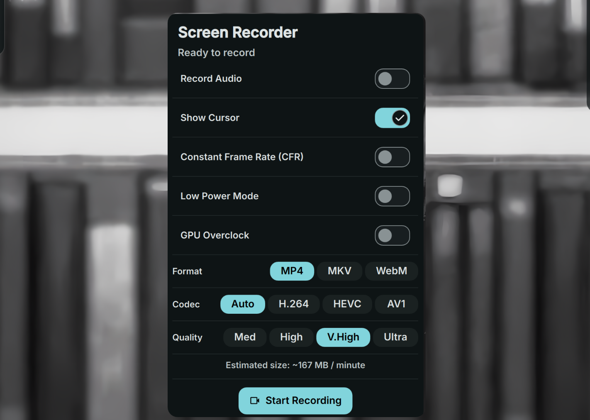

# Screen Recorder Plugin

Wayland screen recorder plugin for DankMaterialShell (DMS), powered by `gpu-screen-recorder`.



## Install

Use the DMS CLI:
```bash
dms plugins install screenRecorderLH
```

Or manually:
```bash
git clone https://github.com/hthienloc/dms-screen-recorder ~/.config/DankMaterialShell/plugins/screenRecorderLH
```

## Features

- **GPU Accelerated** - High-performance hardware encoding (NVENC, VAAPI, AMF).
- **Dynamic Control** - Real-time file size estimation, FPS slider, codec selectors, and audio toggles.
- **Smart Notifications** - First-frame video thumbnail extraction on completion.

## Requirements

- `gpu-screen-recorder`
- `slurp` (for interactive region selection on Wayland)
- `ffmpeg` (for thumbnail extraction)
- `notify-send` (for desktop notifications)

## Wayland Cursor Hiding & KMS Notes

### Screen Mode (`-w screen`)
KMS capture requires special capabilities to interact with the display compositor directly:
```bash
sudo setcap cap_sys_admin+ep /usr/bin/gsr-kms-server
```

### Window Mode (`-w portal`)

> [!IMPORTANT]
> Do **not** apply `setcap` to `/usr/bin/gpu-screen-recorder` itself. Doing so will make it a privileged process, blocking `xdg-desktop-portal` (running under your normal user namespace) from verifying it. This causes window selection to fail with `Portal operation not allowed`.
>
> If you have previously applied it, remove it via:
> ```bash
> sudo setcap -r /usr/bin/gpu-screen-recorder
> ```

## CLI Control via IPC

You can trigger and control the screen recorder directly from the command line using DankMaterialShell IPC commands:

```bash
# Toggle full screen recording
dms ipc screenRecorderLH toggleScreen

# Toggle interactive custom region selection and recording
dms ipc screenRecorderLH toggleRegion

# Toggle recording of the saved region geometry (defined in Settings)
dms ipc screenRecorderLH toggleSavedRegion

# Toggle specific window selection and recording (via Portal)
dms ipc screenRecorderLH toggleWindow

# Toggle portal selection and recording
dms ipc screenRecorderLH togglePortal

# Stop recording
dms ipc screenRecorderLH stop

# Cancel recording (deletes partial output)
dms ipc screenRecorderLH cancel

# Pause or resume recording
dms ipc screenRecorderLH pause

# Get recording status
dms ipc screenRecorderLH status
```

## Roadmap

- [x] **Window Recording Mode** - Fully implement and stabilize Window selection mode using the XDG Desktop Portal interface (`-w portal`), resolving DBus integration and compositor backend compatibility.
- [ ] **Instant Replay Buffer (`-r <sec>`)** - Support saving the last N seconds of screen activity in RAM or disk.
- [ ] **Webcam Overlay (`-w "screen|/dev/video0"`)** - Support embedding a webcam overlay on the recording with custom positioning.
- [ ] **Application Audio Capture (`-a <app_name>`)** - Support recording audio from a specific application instead of the entire system.
- [ ] **Content Frame Rate Mode (`-fm content`)** - Support dynamically adjusting frame rate based on desktop content to save storage.

## License

MIT
